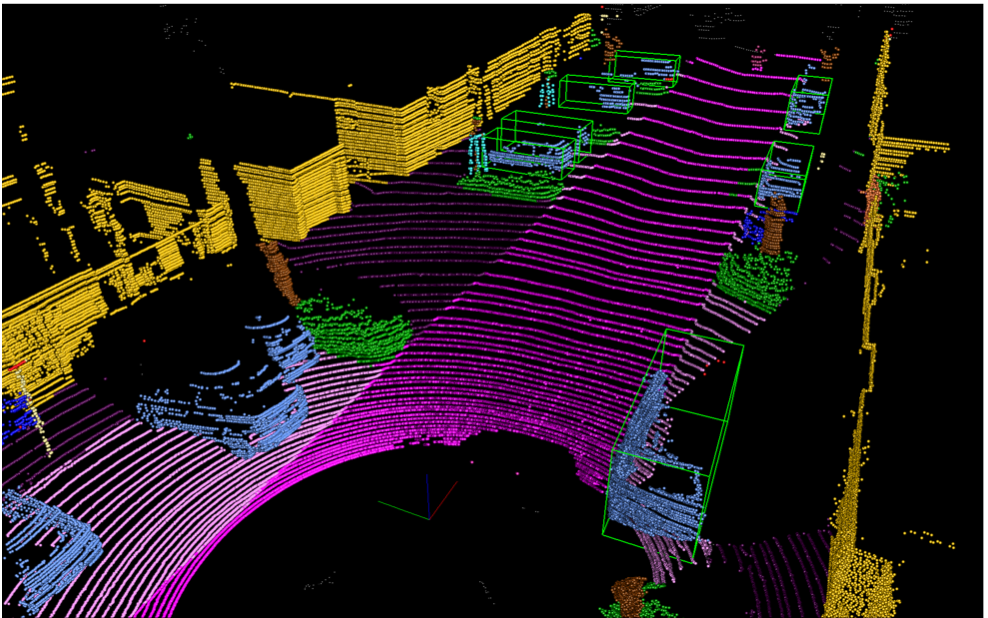
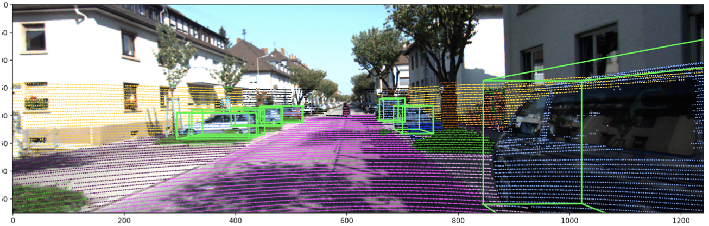
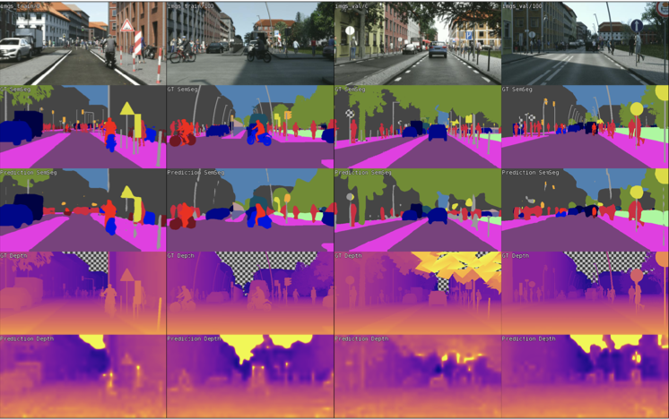
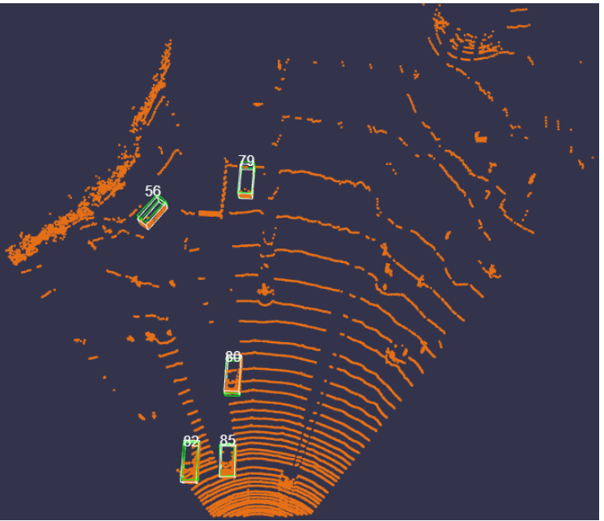

# Deep Learning for Autonomous Driving
This repo contains the projects for the course Deep Learning for Autonomous Driving at ETH Zurich.

## Project 1: Understanding Multimodal Driving Data

<table>
  <tr>
    <td>
    The goal of the first project is to visualize the outputs of common autonomous driving tasks such as 3D object detection and point cloud semantic segmentation given a LiDAR point cloud, the corresponding RGB camera image, the ground truth semantic labels and the network bounding box predictions.

Additional tasks were about identifying each laser ID directly from the point cloud, and dealing with the point cloud distortion caused by the vehicle motion with the aid of GPS/IMU data.
    </td>
    <td>
        
    </td>
  </tr>
</table>

## Project 2: Multi-task learning for semantics and depth

<table>
  <tr>
    <td>
    The goal of the second project is to build Multi-Task Learning (MTL) architectures for dense prediction tasks, i.e. semantic segmentation and monocular depth estimation, exploiting joint architectures, branched architectures, and task distillation.

Bonus task was to improve the network with personal ideas or refer to existing papers to enhance the predictions.
    </td>
    <td>
        
    </td>
  </tr>
</table>

## Project 3: 3D Object Detection from Lidar Point Clouds

<table>
  <tr>
    <td>
    The goal of the third project is to build a 2-stage 3D object detector to detect vehicles in autonomous driving scenes, i.e. drawing 3D bounding boxes around each vehicle. While Project 2 was based on 2D images, in this case irregular 3D point cloud data are exploited to detect vehicles.

The first stage, which is often referred to as the Region Proposal Network (RPN), is used to create coarse detection results from the irregular point cloud data. These initial detections are later refined in the second stage network to generate the final predictions.
    </td>
    <td>
        
    </td>
  </tr>
</table>

